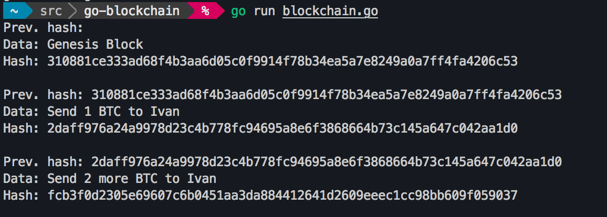

# go-blockchain-rampup

## Approach
- [x] decide on learning approach
- [x] Get golang dev environment set up
  - [x] brew install go
  - [x] vscode extension: https://github.com/Microsoft/vscode-go
  - [ ] debugger: brew install go-delve/delve/delve (requires xcode update 🙃)
- [x] glance through golang language spec
- [ ] walk through blockchain tutorial in go
  - [x] 1. basic prototype
    
  - [ ] 2. proof-of-work
  - [ ] 3. persistance and cli
  - [ ] 4. transactions 1
  - [ ] 5. addresses
  - [ ] 6. transactions 2
  - [ ] 7. network
- [ ] decide on next steps...

## Resources
* https://golang.org/doc/code.html
* https://github.com/Jeiwan/blockchain_go/blob/master/README.md
* language spec: https://golang.org/ref/spec
* slices vs. arrays https://blog.golang.org/go-slices-usage-and-internals
* `goreturns` -> `gofmt` https://github.com/Microsoft/vscode-go/issues/1485
* https://www.youtube.com/watch?v=SSo_EIwHSd4